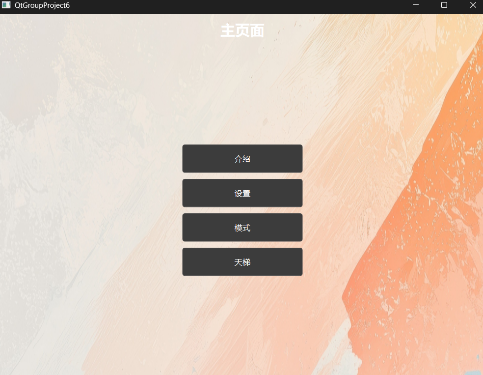
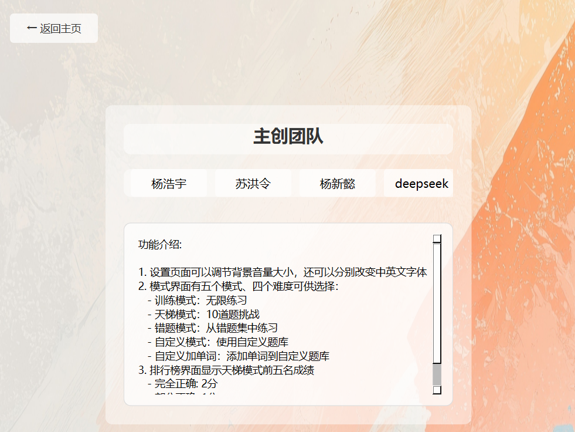
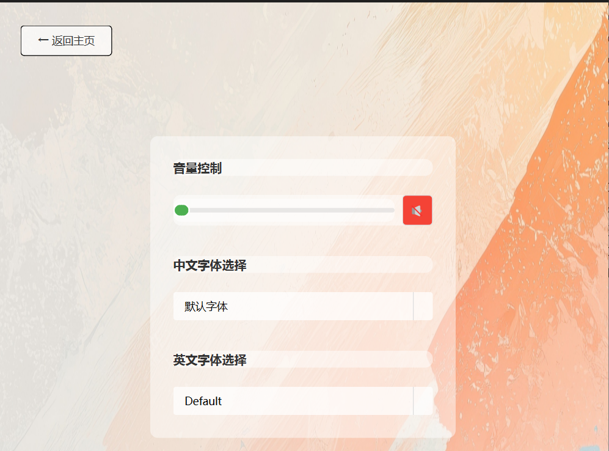
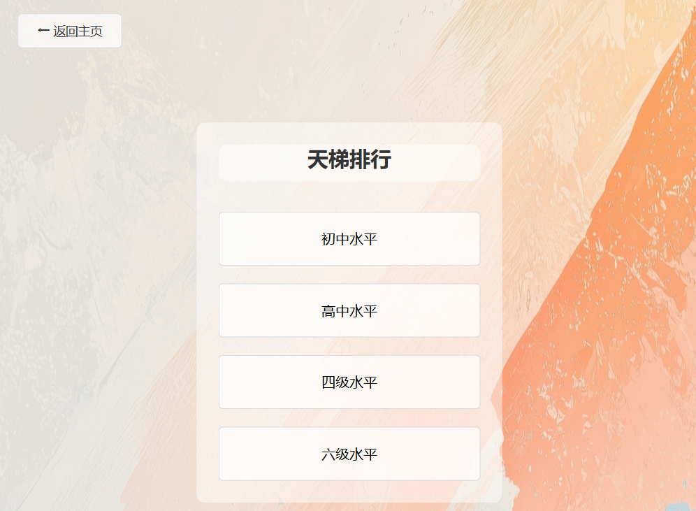
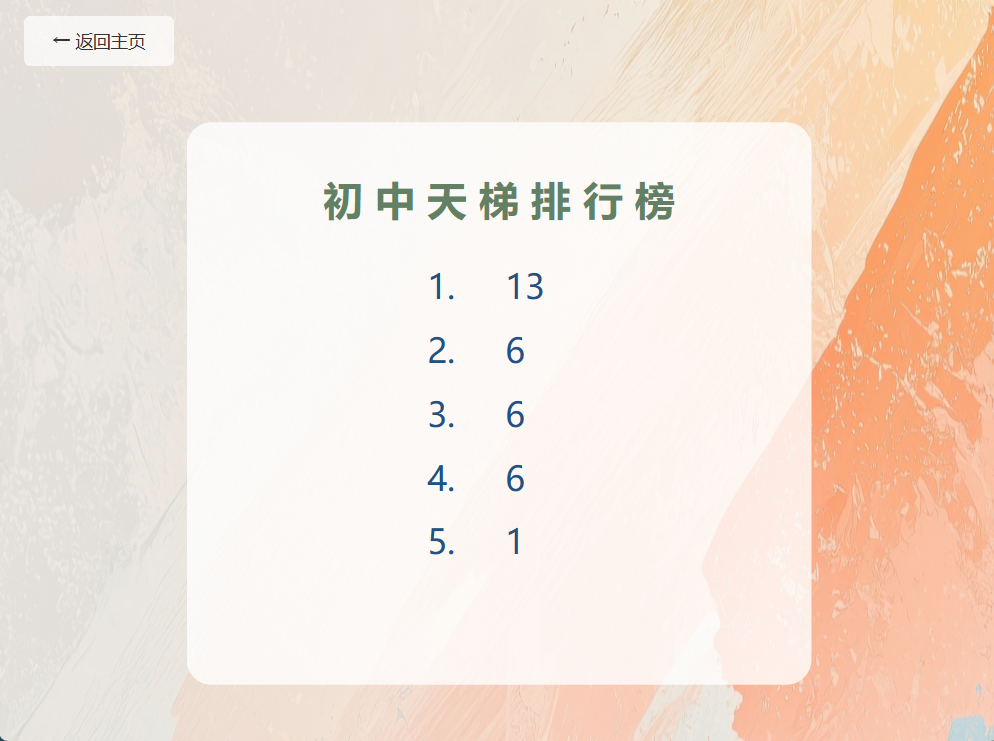
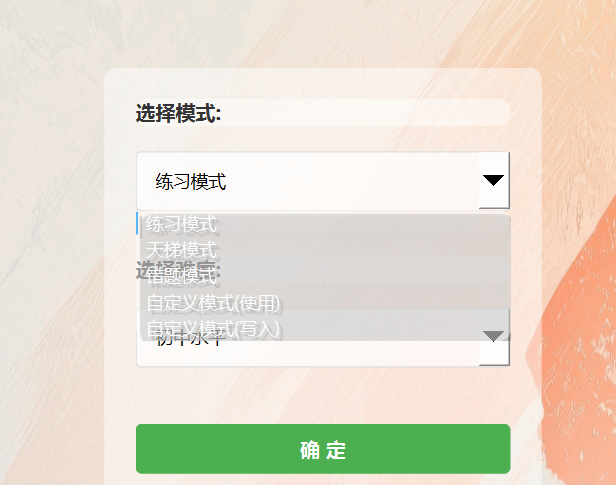
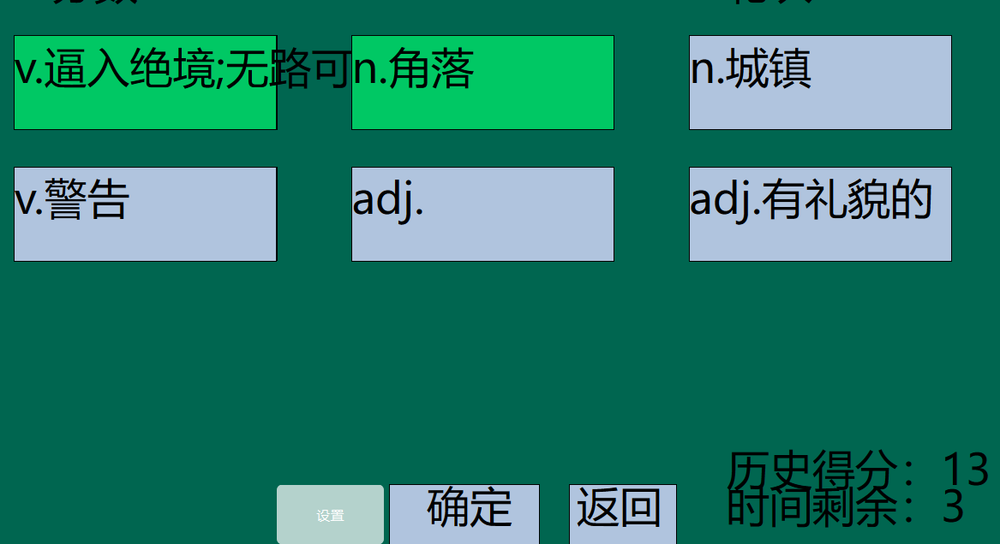
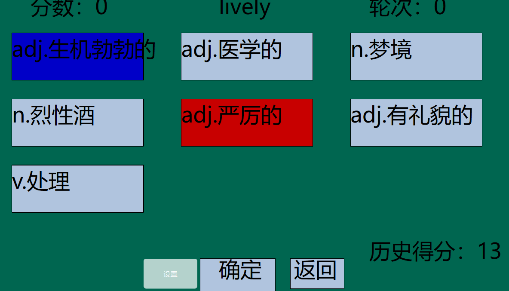
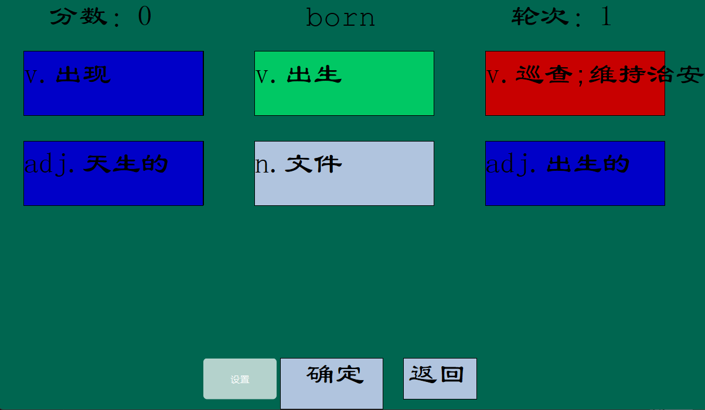

# 英语王者项目介绍：
网盘：https://disk.pku.edu.cn/link/ARF2272DE0A10D47A19BA290994BDF36F4
文件名：Qt项目英语王者演示视频.mp4
文件路径：AnyShare://杨浩宇_2400013163/Qt项目英语王者演示视频.mp4
## 1.项目基本情况
本软件旨在帮助用户温习英语单词知识，采用答题的方式获取分数

注意：data文件夹里面的英语题库需要放在可执行文件同目录，才可以正常工作使用

主页面可以跳转到各个分支页面

介绍界面介绍了团队成员与基础规则

设置界面允许随时调节字体与bgm音量

天梯界面允许查询自己的历史前五记录最高分

模式选择界面允许切换不同模式和难度

## 2.项目功能展示

    模式界面有五个模式、四个难度可供选择：
           - 训练模式：无限练习
           - 天梯模式：10道题挑战
           - 错题模式：从错题集中练习
           - 自定义模式：使用自定义题库
           - 自定义加单词：添加单词到自定义题库
           自定义题库是指软件自带题库加用户自己添加的题目
    
在选定选项之后会有高亮绿色提示，在时间限制结束之前都可修改，在时间结束是自动锁定。每一个单词都是不定项选择

        排行榜界面显示天梯模式前五名成绩
           - 完全正确: 2分
           - 部分正确（部分未选）: 1分
           - 有错误或完全未选: 0分
  
时间到或者点击确定之后，会对选项进行提示，蓝色为正确但未选择的选项，红色为选择错误的选项，绿色为正确已选选项。之后会给用户思考的时间（无限制），点击确定之后进入下一题

返回键会返回主页面，设置会返回设置界面调节音量与字体，可以即时生效

## 3.代码功能介绍：

    
    countdown.cpp:实现倒计时功能
    homepage.cpp:实现主页面画面
    main.cpp:主函数，实现音频播放，界面装饰，直接跳转到homepage
    mainwindow.cpp:关键函数，实现答题，加载历史记录，答题界面绘制，跳转设置界面等答题界面的所有功能
    mode.cpp:实现模式选择界面绘制和功能
    settingspage：实现设置界面绘制和功能
    teampage：实现团队介绍界面
    tianti：实现不同难度天梯排行榜的显示与读取记录的功能
    totalmainwindow：实现不同界面直接相互跳转的信号与槽函数机制
    totiantipage：实现不同难度天梯排行榜的跳转功能
    wordlib.cpp:实现题库读取单词以及正确选项以及错误选项的功能

## 4.版本更新记录

### v1.0 实现基础功能，拥有基础答题界面
### v1.1:实现开始界面ui，优化练习模式界面,新增难度选择，扩充词汇库
### v1.2:新增天梯模式，加入天梯排行榜功能，新增字体调节与音量调节，增加倒计时与分数继承
### v1.3:新增错题模式，支持自定义模式，允许用户自定义题库，新增静音功能
### v1.4:优化整体架构，美化ui界面，在答题界面可以进行设置与返回主页

